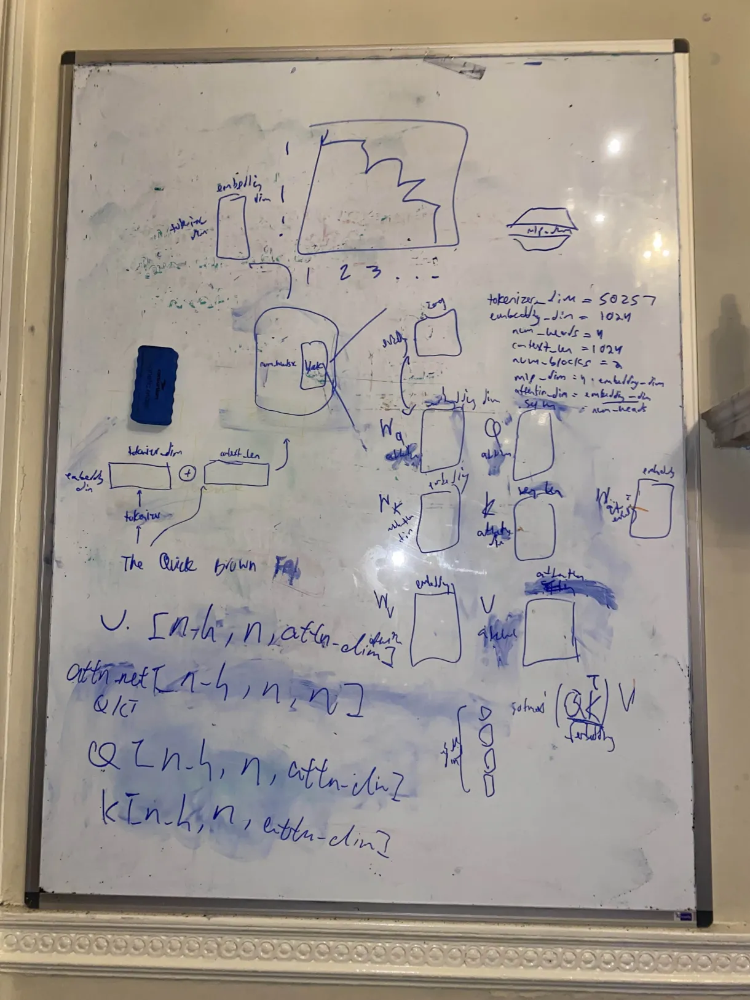

# Transformer from Scratch

### Setup

```bash
# Install uv package manager if not installed already
brew install uv  # or see https://docs.astral.sh/uv/getting-started/installation/

# Create virtual environment and install dependencies
uv init
uv venv
uv pip install -r requirements.txt
```

### Training

```bash
uv run train.py
```

```bash
# examples with flags
uv run train.py --run "a cool ablation" --accum_steps = 4```

#### Training Flags

```bash
# Model architecture parameters
--num_blocks 6              # Number of transformer blocks
--num_heads 8               # Number of attention heads
--embedding_dim 512         # Model embedding dimension
--context_len 1024          # Maximum sequence length

# Training hyperparameters
--lr 3e-4                   # Learning rate for AdamW optimizer
--epochs 1                  # Number of training epochs
--use_muon True             # Use Muon optimizer for hidden layers
--accumulation_steps 4      # Gradient accumulation steps

# Logging parameters
--wandb_enabled True        # Enable Weights & Biases logging
--run "my_experiment"       # Name for wandb run
```

If you want to train in a notebook, press `run all` in the `notebooks/training.ipynb` file.

### File Structure

```
├── train.py          # Main training script and inference
├── config.py         # Model and training configuration
├── model.py          # Transformer architecture (Attention, MLP, etc.)
├── data.py           # DataLoader for tiny_shakespeare
├── optimizer.py      # Muon/AdamW optimizer setup
├── utils.py          # Shared utilities (tokenizer)
└── data/             # Training data directory
    └── tiny_shakespeare.txt
└── notebooks/        # Directory to hold jupyter notebooks
    └── training.ipynb
```

### Logging (Optional)

For [Weights & Biases](https://wandb.ai) logging, create `.env`:
```env
WANDB_API_KEY=your_api_key
WANDB_PROJECT=your_project_name
WANDB_ENTITY=your_entity_name
```

### for future math reference:



### todos
- [x] fix softmax after all mlps, should only be on last
- [x] add layer normalization
- [x] add weight initialization
- [x] add causal masking for training
- [x] add tinyshakespere for some training data
- [x] add param counting
- [x] add logging w/ wandb
- [x] add muon
- [x] modularize notebook into python files
- [x] gradient accumulation
- [x] add attention sink
- [x] improve logging: needs to also show gradient norm, learning rate, time per step, tok/s
- [x] vectorized batch loading
- [x] multi tokenizer support
- [x] max steps flag
- [x] model saving
- [x] fix batching
- [ ] on-by-default torch compile
- [ ] organized console logs
- [ ] data loader chunking