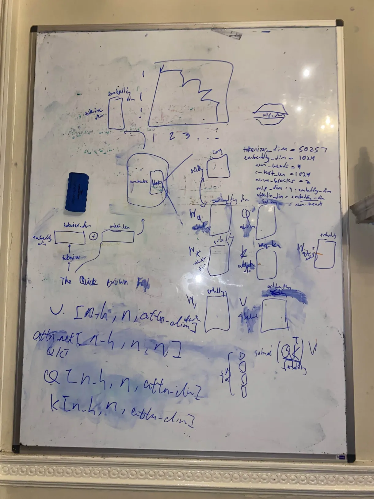

# Transformer from scratch - but not in scratch

### getting started

```bash
# first install uv (`brew install uv` i think)

uv init
uv venv
```
```
uv pip install -r requirements.txt
```


open your jupyter notebook and select the kernel as the venv you just created.

press `run all`.

for future math reference:



### remaining todos
- [x] fix softmax after all mlps, should only be on last
- [ ] add layer normalization
- [ ] add weight initialization
- [ ] add causal masking for training
- [ ] add tinyshakespear for some training data
- [ ] ... many other engineering concerns